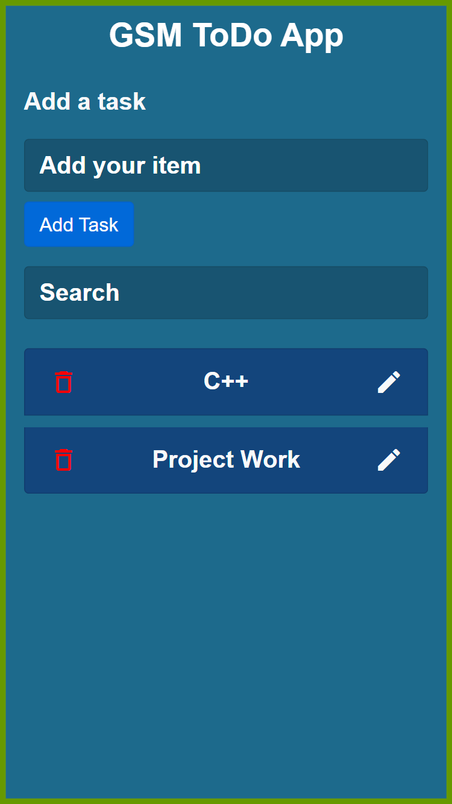

<!DOCTYPE html>
<html lang="en">
<head>
  <meta charset="UTF-8">
  <meta name="viewport" content="width=device-width, initial-scale=1.0">
  
  <title>Todo App</title>
</head>
<body>
  

    <h1>Todo App</h1>
    
A simple and functional Todo application that allows users to manage their daily tasks. This full-stack application is built with HTML, CSS, and JavaScript for the frontend and Node.js, Express, and MongoDB for the backend.

    
    <h2>Features</h2>
    <ul>
      <li>Add, update, and delete tasks.</li>
      <li>Mark tasks as complete.</li>
      <li>Persistent storage with MongoDB.</li>
      <li>Responsive design for various devices.</li>
    </ul>

    <h2>Technologies Used</h2>
    <h3>Frontend</h3>
    <ul>
      <li><strong>HTML5:</strong> Structure of the application.</li>
      <li><strong>CSS3:</strong> Styling and layout.</li>
      <li><strong>JavaScript:</strong> Interactivity and DOM manipulation.</li>
    </ul>
    <h3>Backend</h3>
    <ul>
      <li><strong>Node.js:</strong> JavaScript runtime for server-side logic.</li>
      <li><strong>Express.js:</strong> Web framework for Node.js to build RESTful APIs.</li>
      <li><strong>MongoDB:</strong> NoSQL database for storing tasks.</li>
    </ul>

    <h2>Demo</h2>
    

    <h2>Getting Started</h2>

    <h3>Prerequisites</h3>
    <ul>
      <li>Node.js and npm installed on your machine.</li>
      <li>MongoDB instance running locally or a cloud MongoDB service.</li>
    </ul>

    <h3>Installation</h3>
    <ol>
      <li><strong>Clone the repository:</strong>
        <pre><code>git clone https://github.com/Girijamohantashankar/todo_frontend.git
cd todo-app</code></pre>
      </li>
      <li><strong>Install backend dependencies:</strong>
        <pre><code>npm install</code></pre>
      </li>
      <li><strong>Set up environment variables:</strong> Create a <code>.env</code> file in the root of the project with the following content:
        <pre><code>MONGODB_URI=your_mongodb_connection_string
PORT=5000</code></pre>
      </li>
      <li><strong>Run the backend server:</strong>
        <pre><code>npm start</code></pre>
      </li>
      <li><strong>Serve the frontend:</strong> Open <code>index.html</code> in your browser or use a local server to serve static files.</li>
    </ol>

    <h2>Usage</h2>
    <ul>
      <li>Open the application in your browser.</li>
      <li>Add tasks using the input field and the "Add" button.</li>
      <li>Mark tasks as complete by clicking on the checkbox.</li>
      <li>Edit or delete tasks using the provided buttons.</li>
    </ul>

    <h2>Project Structure</h2>
    <pre><code>todo-app/
│
├── backend/
│   ├── models/
│   │   └── Task.js
│   ├── routes/
│   │   └── tasks.js
│   ├── .env
│   ├── server.js
│   └── package.json
│
├── frontend/
│   ├── css/
│   │   └── styles.css
│   ├── js/
│   │   └── scripts.js
│   ├── index.html
│
└── README.md</code></pre>

    <h2>Contributing</h2>
    
Feel free to submit issues and pull requests. Contributions are always welcome!

    <h2>License</h2>
    
This project is licensed under the MIT License - see the <a href="LICENSE">LICENSE</a> file for details.

    
  

</body>
</html>
